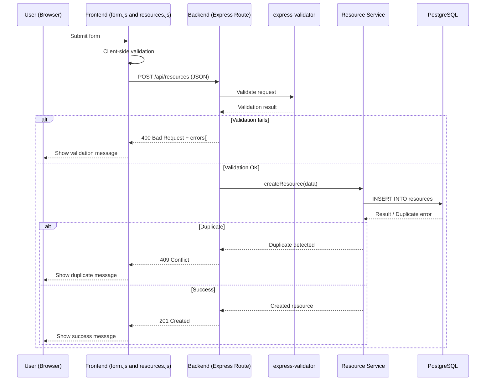

> [!NOTE]
> The material was created with the help of ChatGPT and Copilot.

# G1 CRUD Data Flow – Phase6 Booking System

## Overview

This file documents the CRUD data flow of the Phase6 Booking System.  
It shows how the user, frontend, backend, validation layer, service layer, and PostgreSQL database interact during Create, Read, Update, and Delete operations.

The diagrams are based on the expected Phase6 architecture using:

- frontend JavaScript (`form.js` and `resources.js`)
- Express backend routes
- `express-validator`
- service layer
- PostgreSQL database

Each operation includes both success and failure branches.

---

## 1️⃣ CREATE — Resource (Sequence Diagram)


## 2️⃣ READ — Resource (Sequence Diagram)

```mermaid
sequenceDiagram
    participant U as User (Browser)
    participant F as Frontend (resources.js)
    participant B as Backend (Express Route)
    participant S as Resource Service
    participant DB as PostgreSQL

    U->>F: Open page / refresh
    F->>B: GET /api/resources
    B->>S: getAllResources()
    S->>DB: SELECT * FROM resources
    DB-->>S: Rows / Error

    alt Success
        S-->>B: Resource list
        B-->>F: 200 OK
        F-->>U: Display resources
    else Failure
        S-->>B: Error
        B-->>F: 500 Server Error
        F-->>U: Show error message
    end
 ```    
 ## 3️⃣ UPDATE — Resource (Sequence Diagram)

```mermaid
sequenceDiagram
    participant U as User (Browser)
    participant F as Frontend (form.js and resources.js)
    participant B as Backend (Express Route)
    participant V as express-validator
    participant S as Resource Service
    participant DB as PostgreSQL

    U->>F: Edit resource
    F->>B: PUT /api/resources/:id

    B->>V: Validate request
    V-->>B: Validation result

    alt Validation fails
        B-->>F: 400 Bad Request
        F-->>U: Show validation error
    else Valid
        B->>S: updateResource()
        S->>DB: UPDATE resources WHERE id=?

        alt Not found
            DB-->>S: No row
            S-->>B: Not found
            B-->>F: 404 Not Found
            F-->>U: Show error
        else Success
            DB-->>S: Updated
            S-->>B: OK
            B-->>F: 200 OK
            F-->>U: Show success
        else Failure
            DB-->>S: Error
            S-->>B: Error
            B-->>F: 500 Server Error
            F-->>U: Show error
        end
    end
```
## 4️⃣ DELETE — Resource (Sequence Diagram)

```mermaid
sequenceDiagram
    participant U as User (Browser)
    participant F as Frontend (resources.js)
    participant B as Backend (Express Route)
    participant S as Resource Service
    participant DB as PostgreSQL

    U->>F: Click delete
    F->>B: DELETE /api/resources/:id
    B->>S: deleteResource()
    S->>DB: DELETE FROM resources WHERE id=?

    alt Not found
        DB-->>S: No row
        S-->>B: Not found
        B-->>F: 404 Not Found
        F-->>U: Show error
    else Success
        DB-->>S: Deleted
        S-->>B: OK
        B-->>F: 204 No Content
        F-->>U: Remove from UI
    else Failure
        DB-->>S: Error
        S-->>B: Error
        B-->>F: 500 Server Error
        F-->>U: Show error
    end